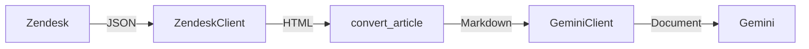
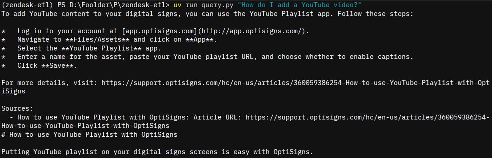

# zendesk-etl

Simple ETL pipeline for Zendesk help centers to Markdown to Google Gemini.



## Development

This project uses `uv` (package management), `ruff` (linting and formatting) and `ty` (type checking).

See `.env.sample` for essential environment variables to set (not automatically loaded, use `mise` or similar).

## Usage

Via `uv` (you can use normal Python):
```sh
uv run bootstrap.py "My Document Store" # returns store ID, put this in your environment
uv run main.py # ETL pipeline
```

Via docker:

```sh
docker build -t zendesk-etl .
docker run --env-file .env zendesk-etl python main.py
```

## Demo

- [GitHub Action pipeline runs](https://github.com/powerstomp/zendesk-etl/actions/workflows/daily-sync.yml)
- [Example run output](https://github.com/powerstomp/zendesk-etl/actions/runs/28706692511/job/85133417999)



## Design decisions

### Gemini file store as single source of truth

Since we want to run the Dockerized pipeline as ephemeral containers, we will need somewhere to store the state of processed articles. We use Gemini API to get a list of uploaded documents for this purpose.

Because the API is paginated (and max 20 documents per query), we will take ~21 API calls to list all of the available documents for our dataset. This is fine for a daily task.

### RAG chunking strategy

We use default Gemini strategy and config. This is optimized for general RAG purposes.
