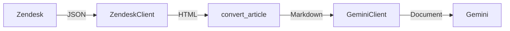

# zendesk-etl

Simple ETL pipeline for Zendesk help centers to Markdown to Google Gemini.



## Development

This project uses `uv` (package management), `ruff` (linting and formatting) and `ty` (type checking).

See `.env.sample` for essential environment variables to set (not automatically loaded, use `mise` or similar).

## Usage

Via `uv` (you can use normal Python):
```sh
uv run bootstrap.py "My Document Store" # returns store ID, put this in your environment
uv run main.py # ETL pipeline
```

Via docker:

```sh
docker build -t zendesk-etl .
docker run --env-file .env zendesk-etl python main.py
```
